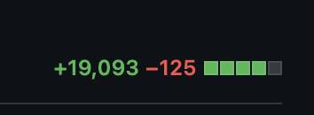
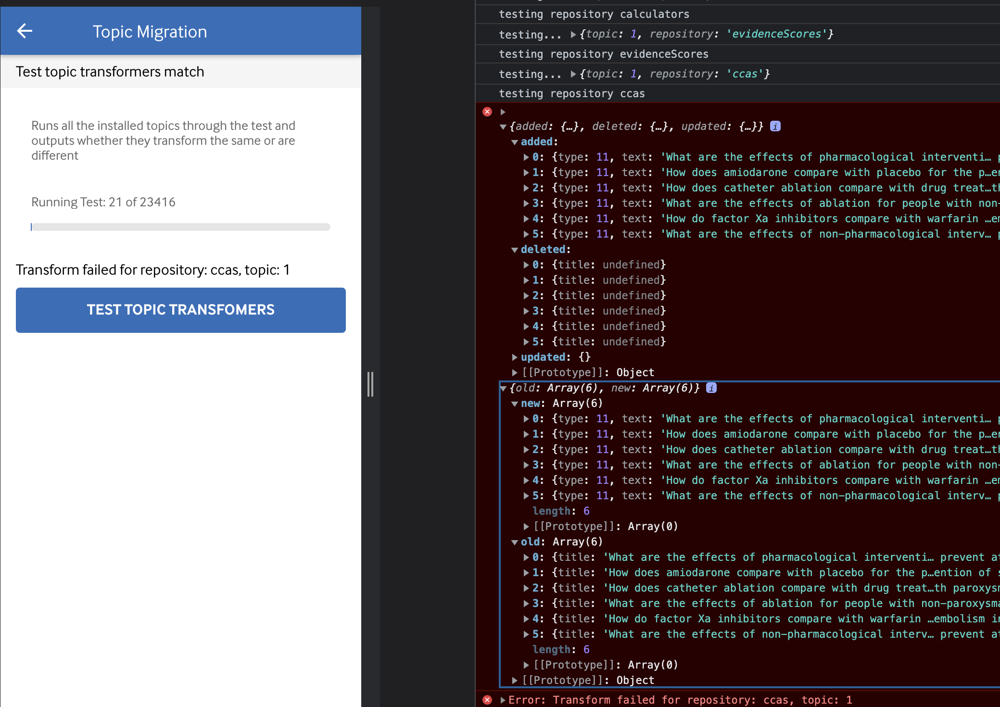

My day job involves working on a mobile app for a well known medical journal based in the UK. It provides healthcare professionals with the latest evidence-based clinical decision support information.

These days the tech stack is aging but its much too large to rewrite all in one go. So instead we are doing a phased migration, gradually re-writing the application bit by bit between releases. We are moving from AngularJS to Angular, which incase you don't know is a huge change as it involves a new framework and language!

I would explain more but it's a long story so I'll save that for another post.

This is the first of a series of posts where I hope to write about the challenges we faced and how we got (or didn't get) over them.

In the app we use content from an API that is stored in JSON serialised form. To display content we first transform this into an object before handing it off to the rendering code to display.

As part of the migration we have to rewrite the transformation layer. Problem is theres about 20,000 lines of code (including tests) which increases the workload and also the chances of bugs sneaking in.



As it stands the layer is written as a single class with a bunch of static methods which we mock during testing. One of the issues with this approach is that the file becomes really large and unwieldy as it has to contain transformation code for every single content type. The other issue is that mocking can often mask issues if the mock doesn't reflect the real world.

Instead we switched to using pure functions, because transforming objects from one format to another seems like the perfect candidate for a pure function if you read enough articles about it. For tests we use the pure functions that we've tested elsewhere rather than mocking. Pros are that we're not mocking much code. Cons are that if something goes wrong jasmine doesn't make it the easiest to see whats up. Trade offs innit.

Another issue we have is despite having a lot of tests it's hard to be sure that the new layer works the same as the old layer. This is a sign that the tests could be improved but thats a story for another day.

We could just risk it and fix problems as we discover them but that sounds like a lot of stress too.

A few years ago my friend [Tom](https://www.tomseldon.co.uk) created a section in the app for dev tooling to live which is super handy. A new tool was added which had one job…

## The Task

For every topic downloaded in the app, first run all the transformers split between old and new, then compare them! If they match then great carry on. If they don't match then stop and show where they differ in something thats easy to use.

Using this tool we can then be happy that both old and new transformers are working the same.

We'd also need to test this against other content languages such as Spanish. Different languages are an area we are particularly weak testing as most tests use English.

Ok well to build this we have to solve a few problems along the way.

## Problem 1: How to Flip Between Old and New Transformers

First up we want to restrict how much code we have to write at once before we can get to testing. The transformation layer is sits below the repository layer so thats where we need to switch between old and new transformers. Each repository extends a `BaseRepository` class which contains some helper methods that all repositories can use.

In `BaseRepository` we added a new private method which checks if we should use the new transformer. This keeps the logic in one place instead of spread out across multiple repositories:

```javascript
_isNewTransformerEnabled () {
  return this._featureFlag.isEnabled('new_transformer');
}
```

Then in each repository (the layer above the transformer) we call this method to see if we should use the old or new transformer

```javascript
find (topicId) {
  return this._rawTopicsRepository.findRawTopic(topicId).then(raw => {
    return this._isNewTransformerEnabled()
      .then(enabled => enabled ?
        this._$window.newHotness.topicParser.parse(raw) :
        TopicParser.parse(raw);
    );
  });
}
```

Cool thats the first problem sorted, we can now toggle between old and new transformers 🙌

## Problem 2: How Can We Toggle the Feature on Demand

In the past our feature flag looked at the state from two sources, either remotely via firebase or locally via the codebase depending on the type of flag it was. This is fine 99% of the time but for our tool we wanted to be able to toggle the feature at runtime, otherwise we'd be comparing the same transformer against itself 🤦‍♂️

To do this we added an overrides feature to the feature flag service. This would allow us to have the final say on whether a flag is enabled or disabled.

The way it works is quite simple, we have an array in the service that stores the overrides. We then have a method which lets users of the feature flag service add overrides.

```javascript
addOverride (flagName, state) {
  this._overrides[flagName] = state;
}
```

Consumers of the feature flag service call `isEnabled()` which gets the status of the flag. If an override exists it ignores the original setting and instead resolves the override. We don't check for falsy because we might want to return false from the overrides.

```javascript
isEnabled (flagName) {
  if (this._overrides[flagName] !== undefined) {
    return this._$q.resolve(this._overrides[flagName]);
  }

  //--- Rest of code gets the flag state from firebase or locally depending on the flag type
}
```

Cool, so this allows us to change the state of a flag whenever we want. A nice bonus is we have a feature flag dev tool which at the moment just shows the state of the flags. Now we have overrides we could toggle flags on or off from the dev tool which would be pretty neat!


## Making the Page

Ok so the page is actually pretty simple, it's just some text that describes what it does and a button that starts the testing.

Initially I struggled to write the code to make all this work, sometimes I get myself in a bit of muddle. To recap what I need to do is:

1. Get all the topics we have in the database
2. For each topic get more data about the topic so I know its type. Different topic types need a different set of transformers
3. We then need to get all the repositories related to the topic
4. For each repository we need to do the following
   1. Disable the `new_transformer` flag
   2. Get the data from the repository
   3. Enable the `new_transformer` flag
   4. Get the data from the repository again (this time it'll be using the new transformers)
   5. Check both to see if they are the same and if not show the difference

I started by getting the topics, then looping over those and getting information about the topics inside that loop, then getting the repositories inside that loop again and then running the tests twice in that loop.

```javascript
for (const topic of topics) {
 const topic = getTopicInfo(topic);
 const repositories = getRepositoryForTopic(topic);
 for(const repo of repositories) {
  disableFlag();
  const a = test();
  enableFlag();
  const b = test();
  compare(a, b);
  if (bad) {
    console.log(what went wrong)
    break;
  }
 }
}
```

Imagine this with promises too and its a bit of a mind ~~f*ck~~. So a ranty walk later I switched approach.

Instead we use promises as they were meant to be used and chain them. (Why didn't I do it this way to start with?!). Starting off we get the topics then with that we map over the resolved array to get more info about each topic like so:

```javascript
this._topicRepository.findAll().then((topics) => {
  return this._$q.all(
    topics.map((topic) => this._topicRepository.findById(topic.id))
  );
});
```

Cool we have an array of detailed topics! Thank u, next.

Now we want to turn this list of topics into a list of repositories. To make this easier in my head I used the jobs analogy so we're creating a flat list of jobs to iterate against. A flat list is easier to imagine than nested loops!

```javascript
_createJobPayload (topic) {
  const jobs = [];
  const repositories = this._getRepositoryFromType(topic.type);
  for (const key in repositories) {
    jobs.push({
      topic: topic,
      repository: repositories[key],
      repositoryName: key
    });
  }

  return jobs;
}
```

So we take a topic and get the repositories for its type. For each repository we create an array of jobs which contains the topic, the repository and the name of the repository. Unfortunately this returns a nested array like this, which isn't what we want because it makes dealing with it much more complex.

```text
[ [[job1], [job2]], [[job3]], …]
```

Luckily es6 added a new array method called `flatMap` which is absolutely marvellous! It turns our nested arrays into a nice flat list 👩‍🍳

```javascript
.then(topics => {
  return topics.flatMap(topic => this._createJobPayload(topic));
})
```

And voila! We now have a nice flat array of jobs to test against.

```text
[ job1, job2, job3, …]
```

Next up (I promise we're nearly done), we need to run the tests sequentially. Normally we could use `async/await` for this but unfortunately for me this wasn't possible (babel in our build system is too old and doesn't understand async/await syntax, yet another reason we want to update).

I wasn't sure how to do this but a quick stack overflow later I found my answer which was surprisingly simple!

```javascript
jobs.reduce(
  (promise, job) =>
    promise.then(() => this._test(job.repository, job.topic, job.key)),
  this._$q.resolve()
);
```

This uses the reduce function and starts off with a resolved promise, it then chains subsequent promises for each job so we only run the next job if the previous one resolved.

Finally (home stretch now) we need to actually do the test. Yep all this waffle above was just getting to the point where we could actually test! Thank you for sticking with me!

```javascript
_test (repository, topic, key) {
  console.log('testing…', { topic: topic.id, repository: key });

  let a = null;
  let b = null;
  return this._disableNewTransformer()
    .then(() => this._testRepository(repository, topic).then(output => a = output))
    .then(() => this._enableNewTransformer())
    .then(() => this._testRepository(repository, topic).then(output => b = output))
    .then(() => {
      const transformSame = JSON.stringify(a) === JSON.stringify(b);
      if (!transformSame) {
        console.error(detailedDiff(a, b), { old: a, new: b });
        throw new Error(`Transform failed for repository: ${key}, topic: ${topic.id}`);
      }
    });
}
```

This is pretty similar to the mock code earlier. We disable the flag, test, enable then test again. To compare the two results we use `JSON.stringify()` which I got from [Samantha's Blog](https://www.samanthaming.com/tidbits/33-how-to-compare-2-objects/) which advised this would do the job albeit with performance and ordering issues but both of these weren't a concern for this, we just wanted to know that they were the same output.

If they don't match we throw an error with the repository and topic that failed. Also we log to the console both old and new JSON so we can dig into it and see whats up.

### Quality of Life Extras

We're more or less done with the tool now which is great news but I wanted to add a few extra things just to make life using the tool a bit nicer. As it stands if there was a difference in the output between transformers it would be pretty tricky to know exactly where that difference is, these objects are often quite big and heavily nested!

We installed a new package called [deep-object-diff](https://www.npmjs.com/package/deep-object-diff) which is cool because it tells you exactly where the two objects differ. We use `detailedDiff` which separates what was added, removed and updated into an object that can be logged to the console. This along with the log of the objects themselves makes finding the change much easier.



Another quality of life update (well thats stretching it a bit). We wanted to know how far in the test we got before it failed, so we added a progress bar and some job counts. It doesn't really help much with the task of fixing differences but it does help game-ify it a bit.

## Conclusion

So thats it really. The tool was a bit of work but it's already been really useful as its identified a few differences which the tests did not pick up. We can then fix those and fix the tests too so we know it'll always behave that way in the future.

Eventually we won't need the tool after we've removed the old transformation layer. But for now it sure helps us all sleep at night better knowing its working just as it did before.
