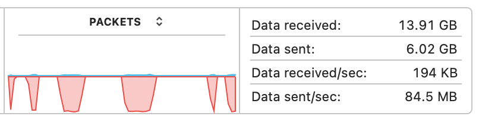
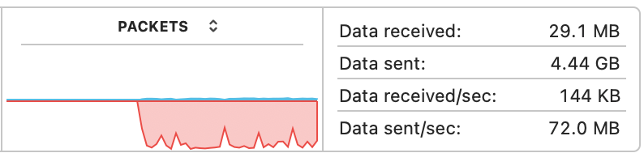

Setting up my NAS last year was probably one of the best things I did, I'll try and do another post on all that but the long and short is I'm using an old PC with Unraid.

Unraid gives you a few options to connect to your NAS, I first tried SMB, I really liked how Mac Finder just discovered it, I didn't have to remember any IP addresses or special commands.

Reads were good, I could browse directories pretty quick, open up files fine. But writing was extremely slow, and worse with lots of files.

At the time I didn't really know what to do, someone on the internet said try NFS and the transfers were much better. But today accidentally crashed my server (my fault not Unraid) and I thought ok time to give SMB another shot.

I tested this by transfering a folder of varying sized MP4's. Finder doesn't have a fancy transfer rate window like windows does so I used Activity Monitors network view which does the job.



This sawtooth pattern is weird, it looks like finder is transferring one file, then reading it before transferring the next.

The internet said that macs aren't setup great for SMB performance. And after a while of trial and error I settled on this config

```toml
[default]
# Disable signing
signing_required=no
# Turn off validation of the negotiate info (helps with signing issues)
validate_neg_off=yes
# Force SMB 3+ for better performance
protocol_vers_map=6
```

After connecting to an smb share on mac we can run `smbutil statshares -a` to get a picture of what that looks like. Unfortunately for me `signing_require` didn't seem to change this to OFF even after restarting.

```txt
SMB_CURR_SIGN_ALGORITHM       AES_128_GMAC
```

I got the same transfer performance when I tested which confirmed more work needed to be done. This config might be unnecessary, and if thats the true I'll update this article.

Next up lets make sure that signing is not on the NAS. In Unraid, Settings > SMB > Samba extra configuration:

```toml
# Force signing off
server signing = disabled
strict sync = no
```

It was adding `strict sync = no` that made the difference, since adding my network transfer looked a lot more consistent.



Speeds aren't amazing but this is equivalent to NFS so I'm happy. After [reading the docs](https://www.samba.org/samba/docs/using_samba/ch11.html) I think it was requiring the server to do a WRITE > READ cycle for every file.

Hopefully this will help you, or more likely future me after I've forgotten about this
