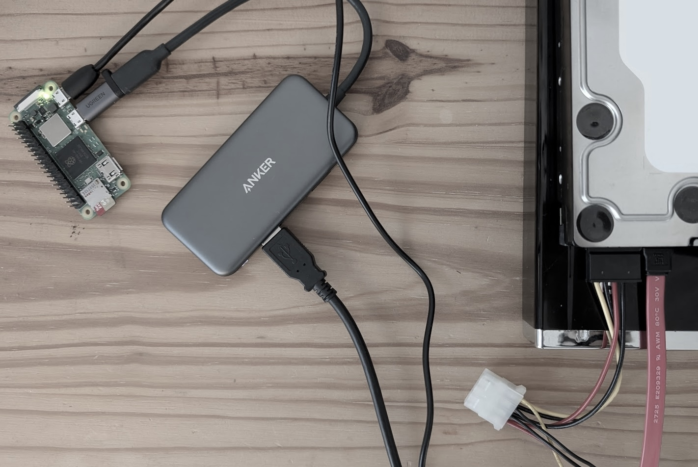

It's a good idea to test a hard drive before using it. They can fail in any number of different ways and losing your precious memories is the last thing you want to happen.

Testing them involves writing and reading data to the entire disk over and over. The idea being if its going to fail let it be while we're writing gibberish.

In Linux there's a tool `badblocks`; it writes patterns to a disk and reads them back. For example _0101_, _1010_, _1111_, and _0000_ in 4 separate passes. If a block can't be read or written to, it will be logged.

This combined with S.M.A.R.T. data can give you confidence in the drive.

One harsh reality is this process can take a while, days rather than minutes. This varies by size and speed of the disk. A 500GB disk will complete the test much faster than a 20TB disk. Equally a 7200rpm drive will be faster than a 5400rpm drive of the same capacity.

So we know this is going to take a while. Unfortunately the only computer that I have running all day is my NAS. I could run the test on that but one typo and I could accidentally wipe the wrong disk!



I want to reduce the consequences of a mistake by having an air gap from my "production" services.

I have a spare Raspberry Pi Zero 2 W which I can use. It even has a few advantages over my laptop:

1. It can run Linux.
2. It's small and low power (2 watts-ish).
3. It's wireless so can be left anywhere.

It's not perfect though; it's USB 2 so the writes are capped at around <span style="white-space: nowrap;">40MB/s</span>. This means our test isn't going to be an absolute torture fest but it's enough to see if these drives will work.

The ports are another downside. While I could have bought a Micro-USB to USB-A dongle, I primarily use USB-C. So I opted instead for a Micro-USB to USB-C adapter. This way, if I'm on holiday with any Micro-USB devices, I don't need to pack a separate charger.

## Setting up the Pi

To get started, flash Raspberry Pi lite OS (I used 64-bit but 32-bit would be fine) to the SD card. Also be sure to fill in the extras so the zero can connect to the network, and your public key so you can ssh in.

Put the SD card into the zero and power it on. I like to leave it for a few minutes to sort itself out on the first boot.

After installing the OS, as a best practice, we should check for updates.

```sh
sudo apt-get update
sudo apt upgrade
```

Once done, we can reboot to apply those changes.

```sh
sudo reboot
```

Now lets ensure S.M.A.R.T. tools are installed so we can keep an eye on the hard drives health.

```sh
sudo apt install smartmontools
```

Lets also install `tmux` so we can leave running commands without stopping.

```sh
sudo apt install tmux
```

Luckily, `badblock` is usually part of Raspberry Pi OS so we don't need to install it. With that we have all the software we need.

## Running the test

Now we can plug in our hard drive into the Pi.

For 3½" drives we'll need it to be powered separately but with 2½" we may get away with using the usb port on the Pi itself. YMMV.

Next lets find our drive name.

```sh
lsblk
```

This will list all our drives. I tend to use the size to identify it. Lets make a note of the name, it'll become very important later on.

```sh
NAME        MAJ:MIN RM   SIZE RO TYPE MOUNTPOINTS
loop0         7:0    0   416M  0 loop
sda           8:0    0 465.8G  0 disk // <--- this is our harddrive :)
├─sda1        8:1    0     1G  0 part
├─sda2        8:2    0     1G  0 part
└─sda3        8:3    0 463.8G  0 part
sdb           8:16   1     0B  0 disk
sdc           8:32   1     0B  0 disk
mmcblk0     179:0    0  59.5G  0 disk
├─mmcblk0p1 179:1    0   512M  0 part /boot/firmware
└─mmcblk0p2 179:2    0    59G  0 part /
zram0       254:0    0   416M  0 disk [SWAP]
```

Open a tmux session `tmux` and check the drives block size. In the code sample below I've used sda but it might be different so use the **name** noted previously.

```sh
sudo blockdev --getbsz /dev/sda
```

This will give us a number, such as _4096_. In fact most hard drives that are 4 terabytes or greater will have a 4096 block size.

We are now ready for the most dangerous part of the operation. Running our test will overwrite the entire disk so its vital we **double check the name of our drive**. If there is any doubt, run `lsblk` again.

```sh
sudo badblocks -w -s -b 4096 /dev/sda
```

We can then quit tmux using <kbd>ctrl + b</kbd> and then <kbd>d</kbd>.

That's it, we are now testing the drive!

During the test we can take a look at our S.M.A.R.T. attributes at any time.

```sh
sudo smartctl -A /dev/sda
```

It will return something like this:

```sh
ID# ATTRIBUTE_NAME          FLAG     VALUE WORST THRESH TYPE      UPDATED  WHEN_FAILED RAW_VALUE
  1 Raw_Read_Error_Rate     0x002f   200   200   051    Pre-fail  Always       -       0
  3 Spin_Up_Time            0x0027   164   159   021    Pre-fail  Always       -       4800
  4 Start_Stop_Count        0x0032   090   090   000    Old_age   Always       -       10065
  5 Reallocated_Sector_Ct   0x0033   200   200   140    Pre-fail  Always       -       0
  7 Seek_Error_Rate         0x002e   100   253   000    Old_age   Always       -       0
  9 Power_On_Hours          0x0032   001   001   000    Old_age   Always       -       75711
 10 Spin_Retry_Count        0x0032   100   100   000    Old_age   Always       -       0
 11 Calibration_Retry_Count 0x0032   100   253   000    Old_age   Always       -       0
 12 Power_Cycle_Count       0x0032   100   100   000    Old_age   Always       -       86
192 Power-Off_Retract_Count 0x0032   200   200   000    Old_age   Always       -       8
193 Load_Cycle_Count        0x0032   197   197   000    Old_age   Always       -       10065
194 Temperature_Celsius     0x0022   109   082   000    Old_age   Always       -       38
195 Hardware_ECC_Recovered  0x0036   001   001   000    Old_age   Always       -       342037046
196 Reallocated_Event_Count 0x0032   200   200   000    Old_age   Always       -       0
197 Current_Pending_Sector  0x0032   200   200   000    Old_age   Always       -       0
198 Offline_Uncorrectable   0x0030   100   253   000    Old_age   Offline      -       0
199 UDMA_CRC_Error_Count    0x0032   200   200   000    Old_age   Always       -       0
200 Multi_Zone_Error_Rate   0x0008   100   253   000    Old_age   Offline      -       0
```

It's useful to keep an eye on it for changes.

The `Current_Pending_Sector`, `Reallocated_Sector_Ct` and `Offline_Uncorrectable` are worth keeping an eye on. These identify when the drive was not able to read the data it has written and are indicators of a failure.

Another attribute to keep an eye on is `Temperature_Celsius` which tells us how hot our drive is in ℃. A good range is 20-45℃ and most drives under test will sit towards the top end of that range.

Finally `Power_On_Hours` lets us know how old the drive is. My drive has >75k hours which equates to over 8 years!

## Happy testing!

What I love most about this setup is how unobtrusive it is. It sits in the corner, quietly testing my drive, sipping watts as it does so.

Should the worst happen, we can start over knowing the damage is limited to the Pi. This alone saves me a lot of stress when running tests!

What's the oldest hard drive you've got still going strong? I'd love to know!
